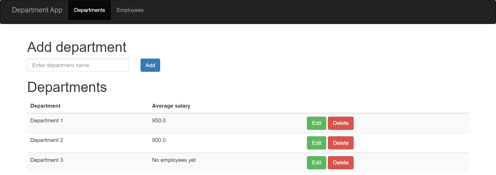
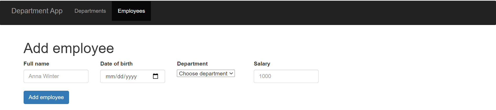
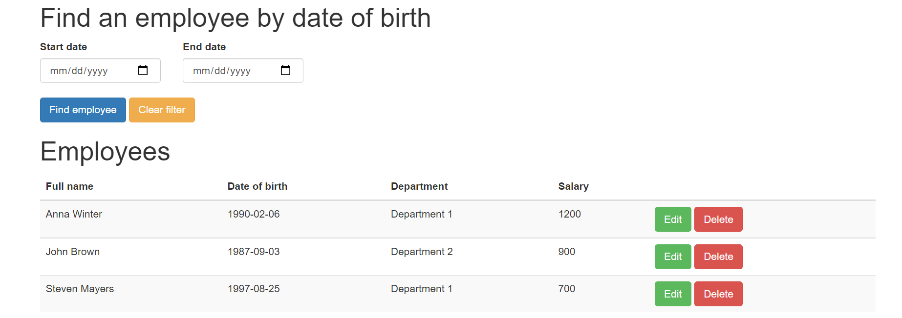

# Python 2021 final project: Department App


## Description
This is the project for EPAM Python [OnlineUA] Autumn course. Project represents web application that manages database of departments and employees.
## What can it do?
- Display a list of departments and the average salary (calculated automatically) for these departments
- Display a list of employees in the departments with an indication of the salary for each employee and a search field to search for employees born on a certain date or in the period between dates
- Change (add / edit / delete) the above data
## Screenshots
That is an example of what user can see on Departments page.



That is an example of what user can see on Employees page.



To find employee by date of birth start and end date should be chosen.
After pressing 'Find employee' button employees with applied filter would 
be displayed below. Press 'Clear filter' button to return to all employees.


## Installation
1. Create a local copy of the project with a command:
```bash
git clone https://github.com/gajchka/Python_2021_final_project.git
```
2. Go to Python_2021_final_project directory
3. Create a virtual environment in the directory
```bash
python3 -m venv Python_2021_final_project/venv
```
4. Activate virtual environment
```bash
source venv/bin/activate
```
5. Install the requirements
```bash
pip install -r requirements.txt
```
6. Run the application
```bash
python3 run_app.py
```
## Author info
- Iryna Feshchenko
- gajchka@gmail.com
